# Website quản lý rạp chiếu và đặt vé xem phim online.

* ## Chức năng:
  ### User:
  
    - Đăng nhập, đăng ký tài khoản, lấy lại mật khẩu qua `email`, đổi mật khẩu, cập nhật thông tin tài khoản.
    
    - Xem lịch chiếu theo rạp.
    
    - Xem lịch chiếu theo phim.
    
    - Xem chi tiết lịch chiếu phim.
    
    - Xem danh sách phim, tìm kiếm phim, xem chi tiết phim.
    
    - Đánh giá phim.
    
    - Đặt vé online thanh toán qua `VNPAY`.
    
    - Xem đơn hàng.
    
    - Hủy đặt vé.

    - Tạo vé với QR code.

  ### Admin:
  
    - Xem thống kê doanh thu theo tháng, số đơn hàng theo tháng, các phim có doanh thu cao nhất.
    
    - Export kết quả thống kê ra file `Excel`.
    
    - Quản lý User.
    
    - Quản lý phim, danh mục phim.
    
    - Quản lý rạp chiếu, phòng chiếu, ghế.
    
    - Quản lý lịch chiếu phim.
    
    - Xem thông tin đơn hàng.

    - Kích hoạt vé.
    
* ## Công nghệ sử dụng
    - Microservices
    - Spring boot
    - ReactJS
    - Keycloak
    - MariaDB
    - Kafka
    - Elastic Search
    - gRPC
    - Redis

* ## Demo
  
  - ### Xem lịch chiếu theo rạp
  
  :------------------------:
    
    
  
  - ### Xem lịch chiếu theo phim, chi tiết phim, đánh giá phim
  
  :------------------------:
  
    
  
  - ### Xem chi tiết lịch chiếu
  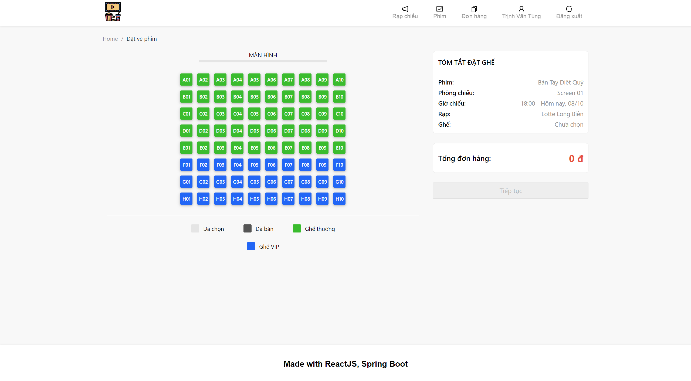
  :------------------------:
  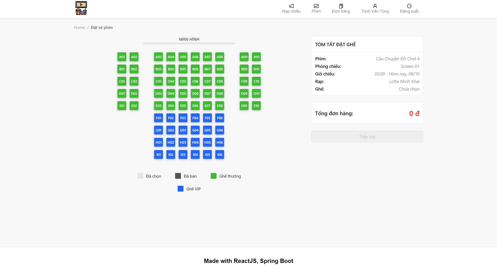  
  
    
  
  - ### Xem tất cả phim, tìm kiếm phim
  
  :------------------------:
  
  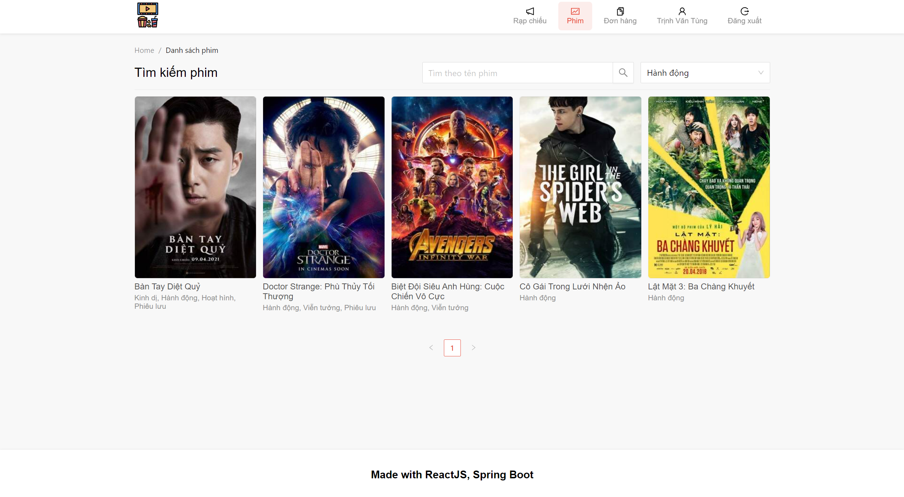

    
  
  - ### Đặt vé
  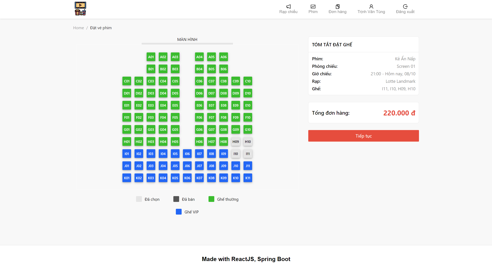
  :------------------------:
  
  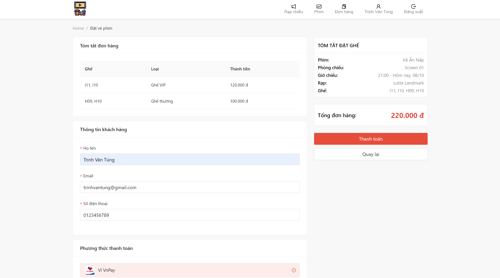 | 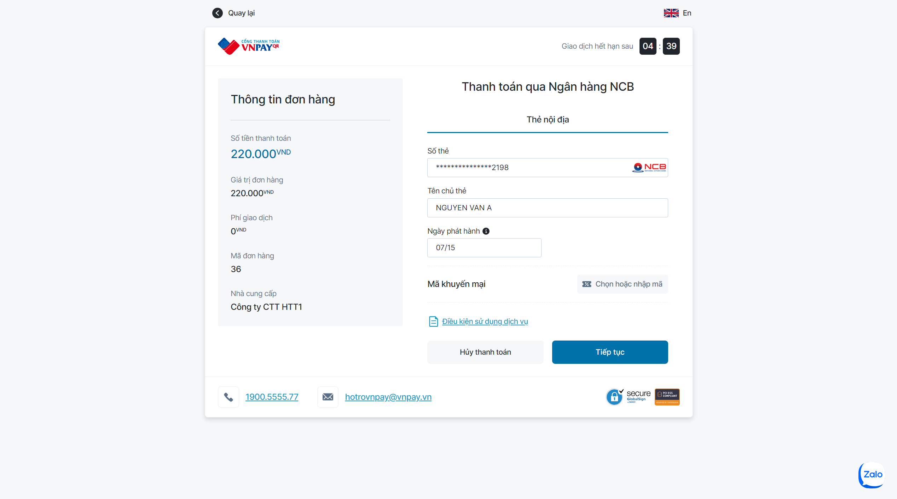
  :------------------------:|:-------------------------:
   | 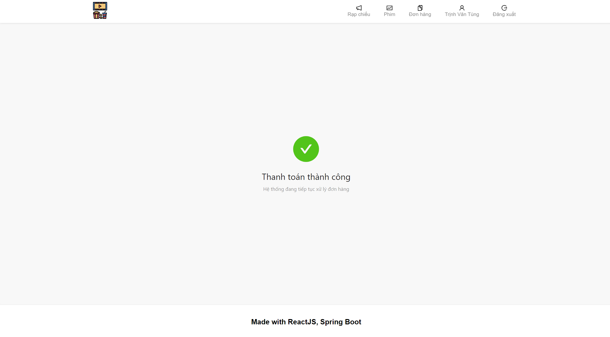
  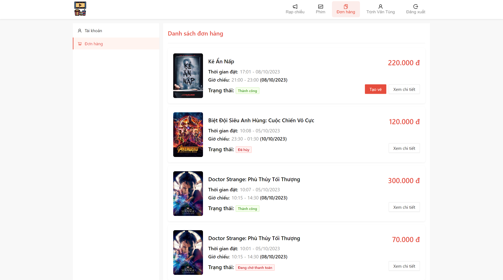 | 
  
    
  
  - ### Tạo vé
  
  :------------------------:
    
    
  
  - ### Hủy đặt vé
  
  :------------------------:
  
  
    
  
  - ### Quản lý đơn hàng
  
  :------------------------:
  

    
  
  - ### Đăng nhập, đăng ký, quên mật khẩu
  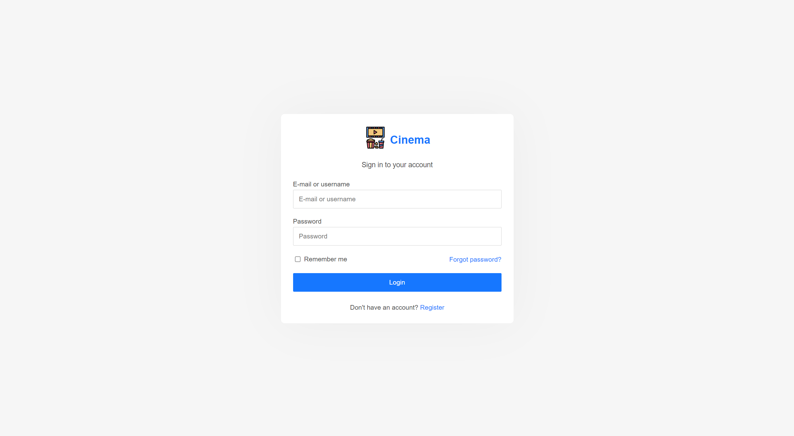
  :------------------------:
  
  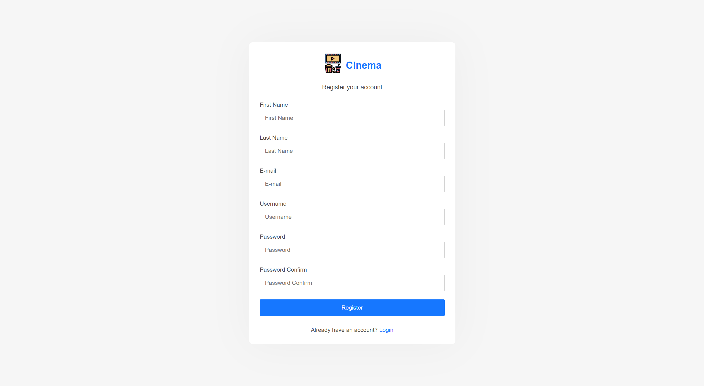
    
    
  
  - ### Thông tin tài khoản
  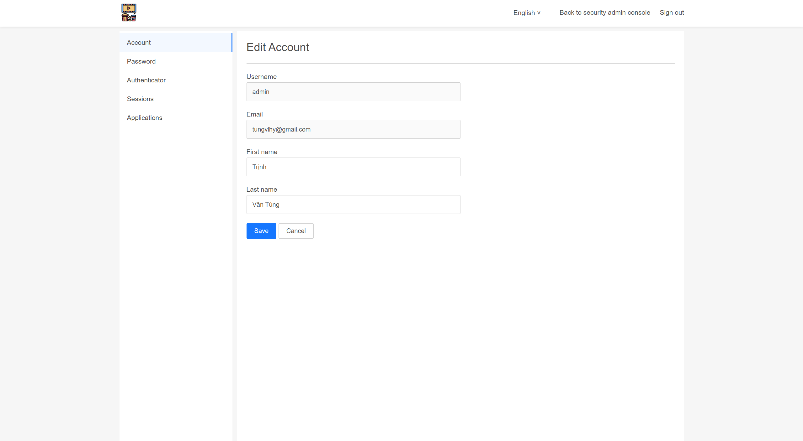
  :------------------------:
  
    
    
  

  - ### Dashboard
  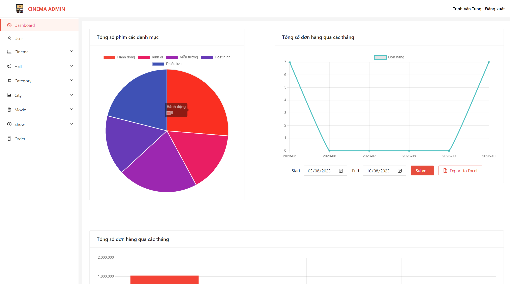
  :------------------------:
  
  
    
    
  
  - ### Quản lý người dùng
  
  :------------------------:
    
    
  
  - ### Quản lý rạp chiếu
  
  :------------------------:
  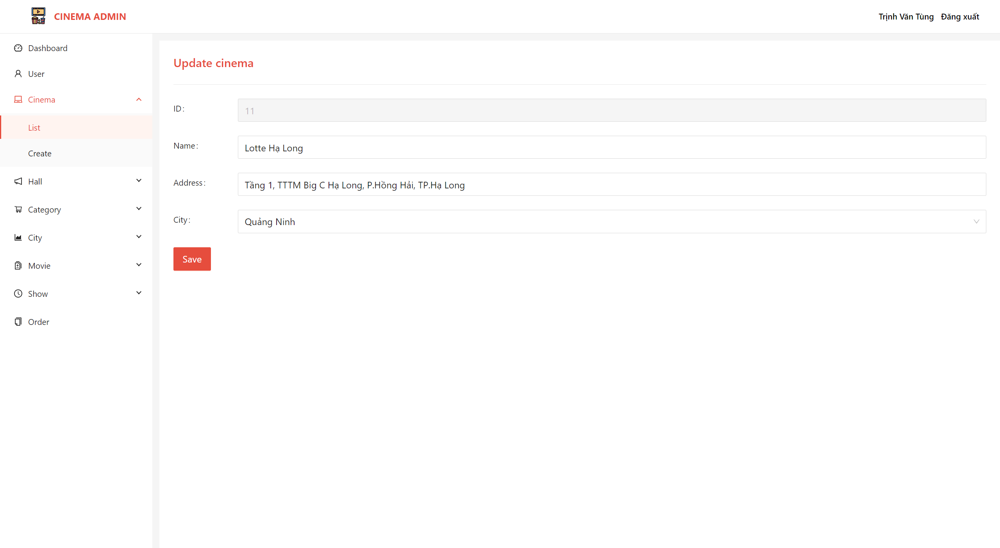
    
    
  
  - ### Quản lý phòng chiếu
   | 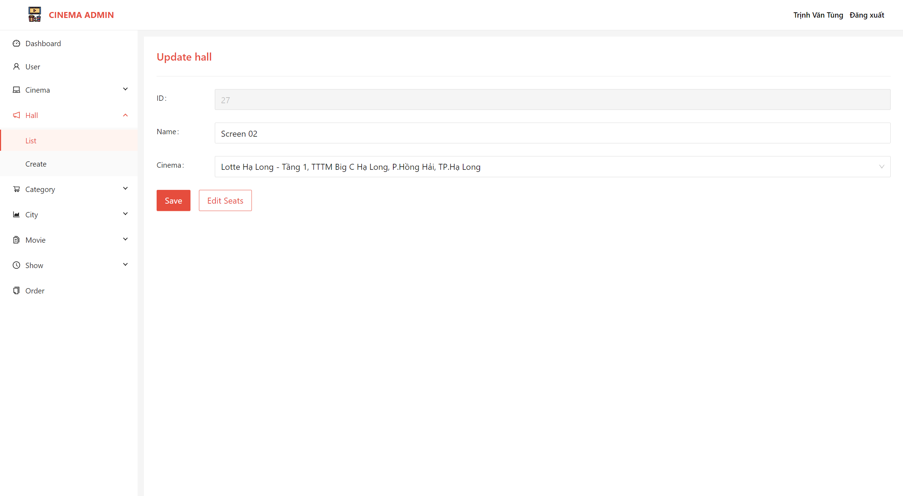
  :------------------------:|:-------------------------:
   | 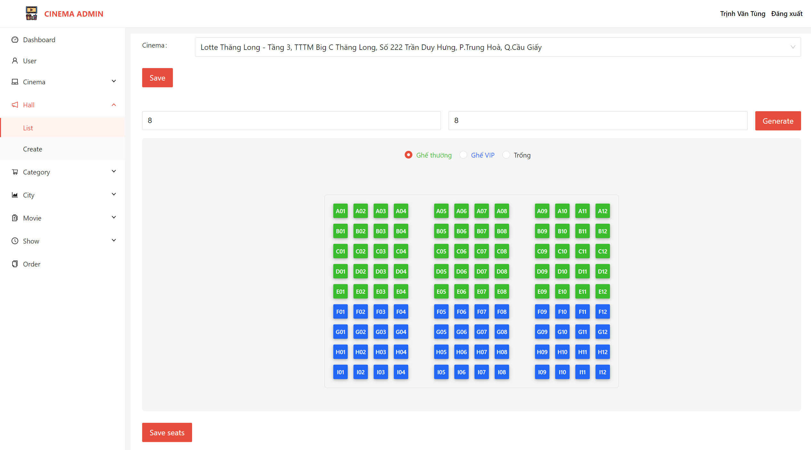
  
    
  
  - ### Quản lý thành phố
  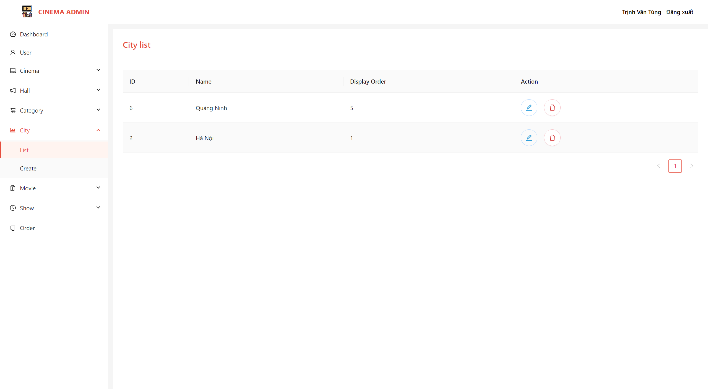
  :------------------------:
    
    
  
  - ### Quản lý danh mục phim
  
  :------------------------:
    
    
  
  - ### Quản lý phim
  
  :------------------------:
  
    
    
  
  - ### Quản lý lịch chiếu
  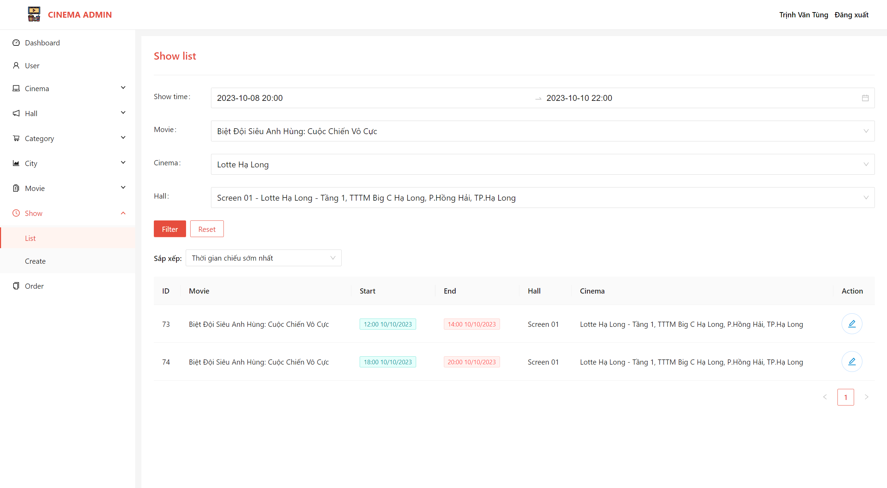
  :------------------------:
  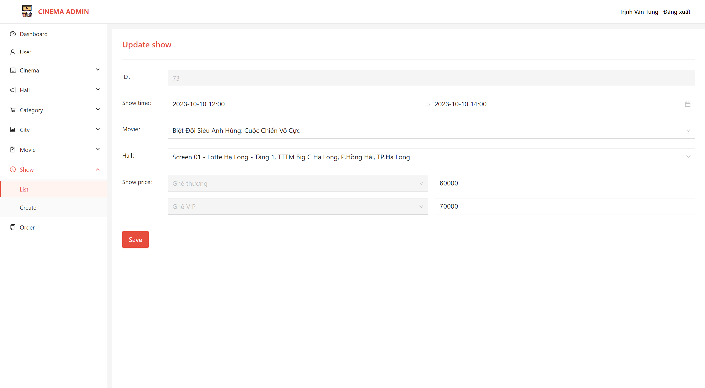
    
    
  
  - ### Quản lý đơn hàng
  
  :------------------------:
  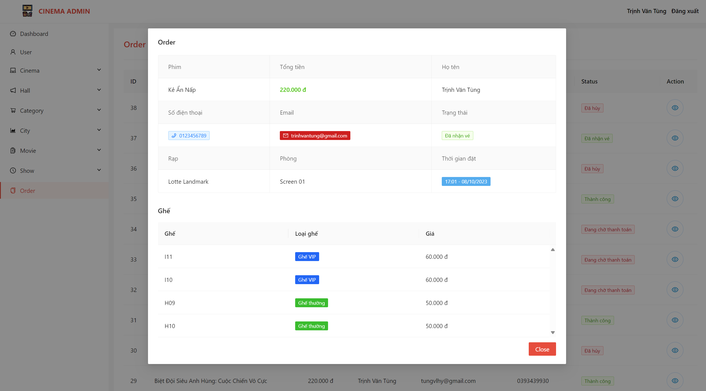
  
      
    
  
  - ### Kích hoạt vé
  
  :------------------------:

    
  