# Website quản lý rạp chiếu phim và đặt vé xem phim online.

* ## Chức năng:
  ### User:
    - [Đăng nhập, đăng ký tài khoản, lấy lại mật khẩu qua `email`](#đăng-nhập-đăng-ký-quên-mật-khẩu).
    - [Đổi mật khẩu, cập nhật thông tin tài khoản.](#thông-tin-tài-khoản)
    - [Xem lịch chiếu theo rạp.](#xem-lịch-chiếu-theo-rạp)
    - [Xem lịch chiếu theo phim.](#xem-lịch-chiếu-theo-phim-chi-tiết-phim-đánh-giá-phim)
    - [Xem chi tiết lịch chiếu phim.](#xem-chi-tiết-lịch-chiếu)
    - [Xem danh sách phim, tìm kiếm phim, xem chi tiết phim.](#xem-tất-cả-phim-tìm-kiếm-phim)
    - [Đánh giá phim.](#xem-lịch-chiếu-theo-phim-chi-tiết-phim-đánh-giá-phim)
    - [Đặt vé online thanh toán qua `VNPAY`.](#đặt-vé)
    - [Xem đơn hàng.](#quản-lý-đơn-hàng)
    - [Hủy đặt vé.](#hủy-đặt-vé)
    - [Tạo vé với QR code.](#tạo-vé)
  ### Admin:
    - [Xem thống kê doanh thu theo tháng, số đơn hàng theo tháng, các phim có doanh thu cao nhất.](#dashboard)
    - [Export kết quả thống kê ra file `Excel`.](#dashboard)
    - [Quản lý User.](#quản-lý-người-dùng)
    - [Quản lý rạp chiếu, phòng chiếu, ghế.](#quản-lý-rạp-chiếu)
    - [Quản lý phim, danh mục phim.](#quản-lý-phim)
    - [Quản lý lịch chiếu phim.](#quản-lý-lịch-chiếu)
    - [Xem thông tin đơn hàng.](#quản-lý-đơn-hàng-1)
    - [Kích hoạt vé.](#kích-hoạt-vé)
* ## Công nghệ sử dụng
    - Microservices
    - Spring boot
    - ReactJS
    - Keycloak
    - MariaDB
    - Kafka
    - Elastic Search
    - gRPC
    - Redis
* ## Demo
  - ### Xem lịch chiếu theo rạp
  
  :------------------------:
    
    
  
  - ### Xem lịch chiếu theo phim, chi tiết phim, đánh giá phim
  
  :------------------------:
  
    
  
  - ### Xem chi tiết lịch chiếu
  
  :------------------------:
    
  
    
  
  - ### Xem tất cả phim, tìm kiếm phim
  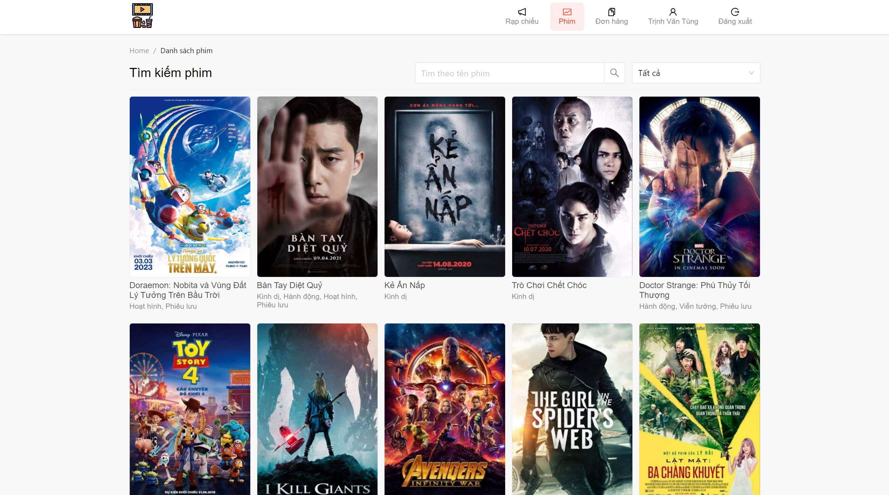
  :------------------------:
  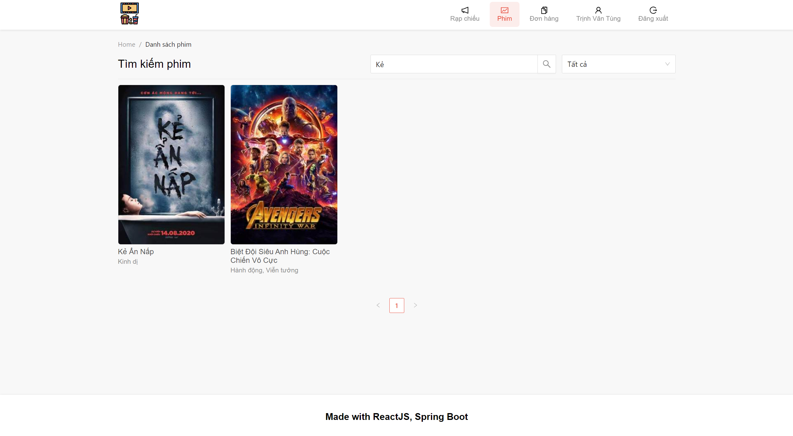
  

    
  
  - ### Đặt vé
  
  :------------------------:
  
   | 
  :------------------------:|:-------------------------:
  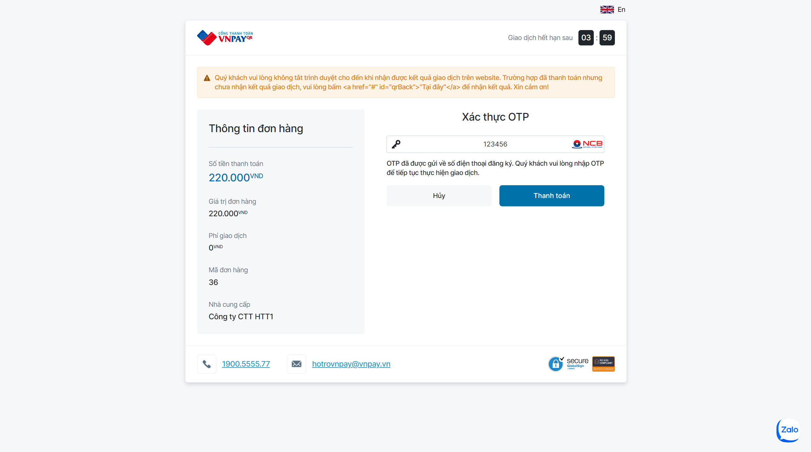 | 
   | 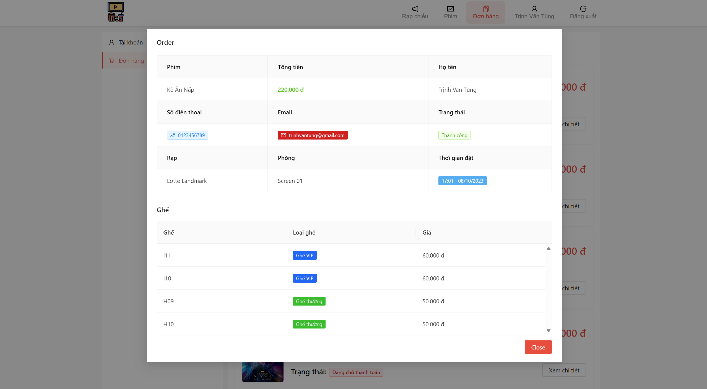
  
    
  
  - ### Tạo vé
  
  :------------------------:
    
    
  
  - ### Hủy đặt vé
  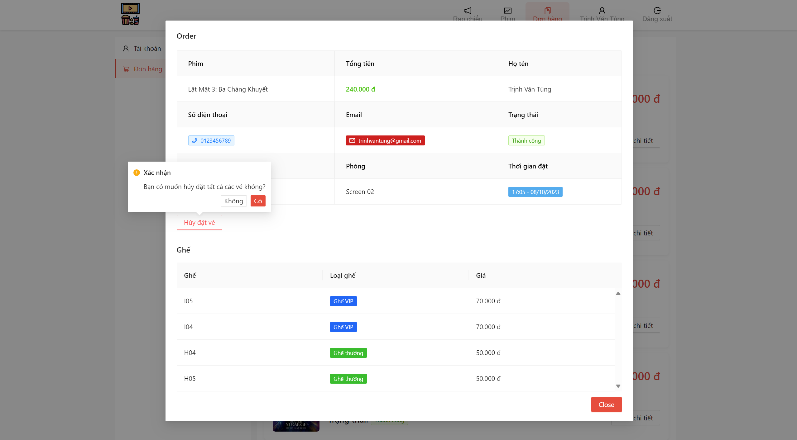
  :------------------------:
  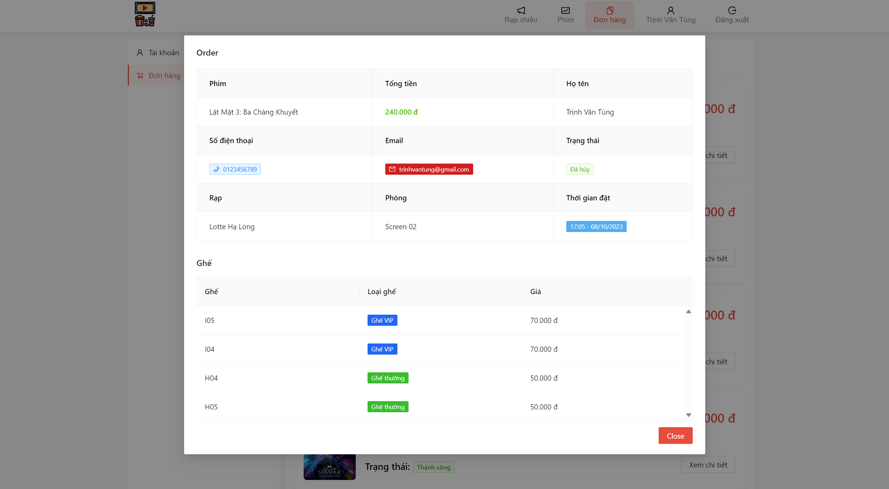
  
    
  
  - ### Quản lý đơn hàng
  
  :------------------------:
  

    
  
  - ### Đăng nhập, đăng ký, quên mật khẩu
  
  :------------------------:
  
  
    
    
  
  - ### Thông tin tài khoản
  
  :------------------------:
  
    
    
  

  - ### Dashboard
  
  :------------------------:
  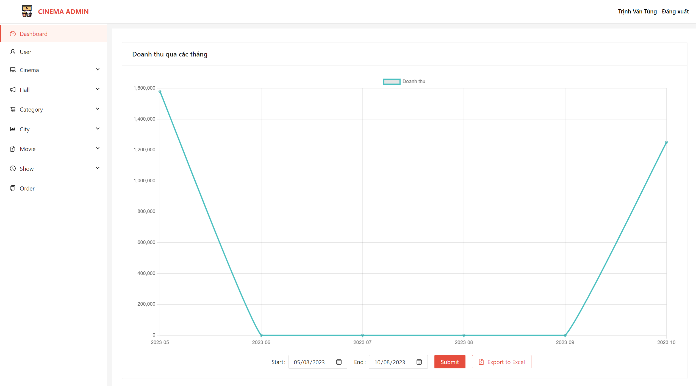
  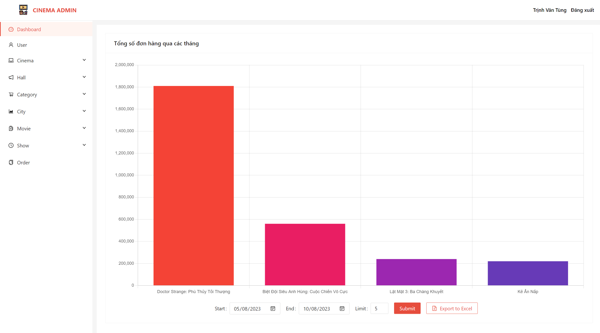
    
    
  
  - ### Quản lý người dùng
  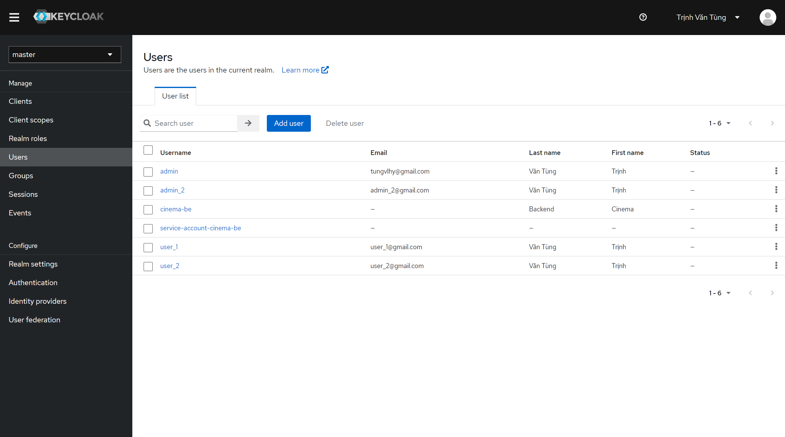
  :------------------------:
    
    
  
  - ### Quản lý rạp chiếu
  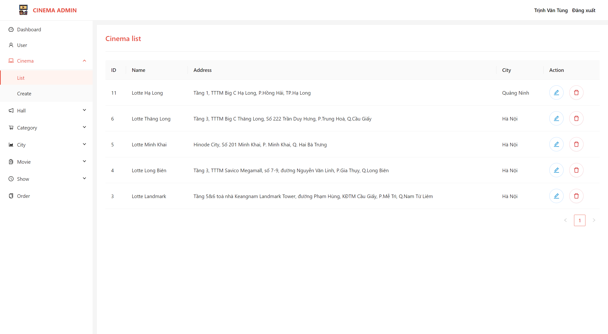
  :------------------------:
  
    
    
  
  - ### Quản lý phòng chiếu
  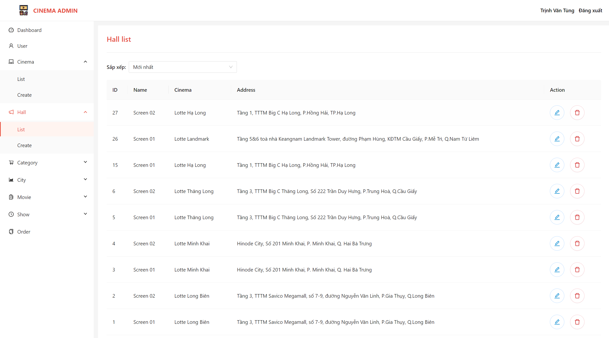 | 
  :------------------------:|:-------------------------:
  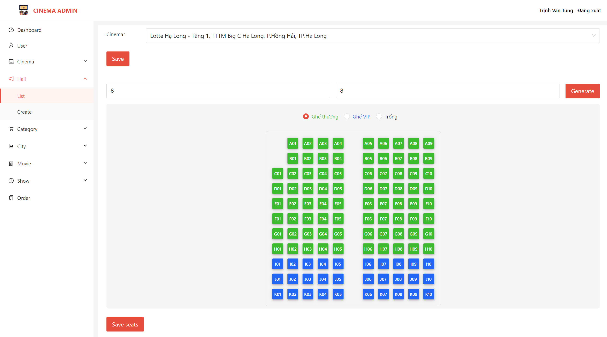 | 
  
    
  
  - ### Quản lý thành phố
  
  :------------------------:
    
    
  
  - ### Quản lý phim
  
  :------------------------:
  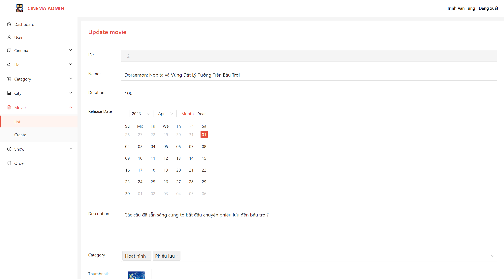
  
    
  
  - ### Quản lý danh mục phim
  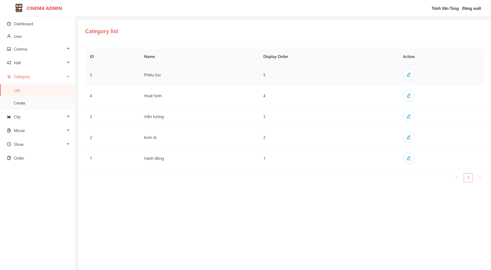
  :------------------------:
    
    
  
  - ### Quản lý lịch chiếu
  
  :------------------------:
  
    
    
  
  - ### Quản lý đơn hàng
  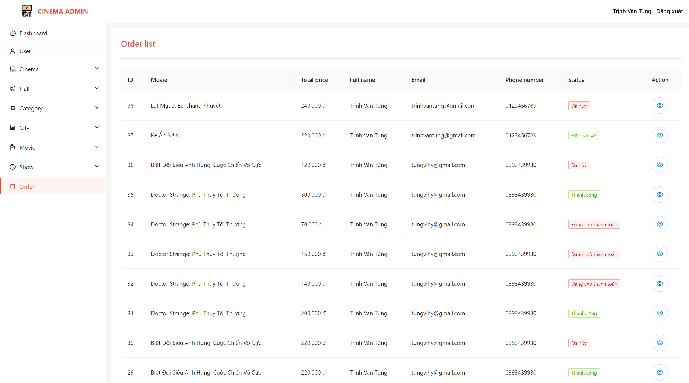
  :------------------------:
  
  
      
    
  
  - ### Kích hoạt vé
  
  :------------------------:

    
  
